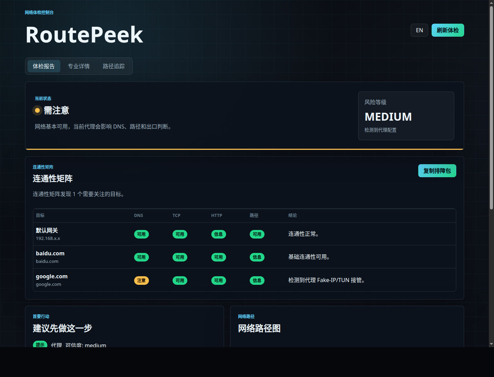
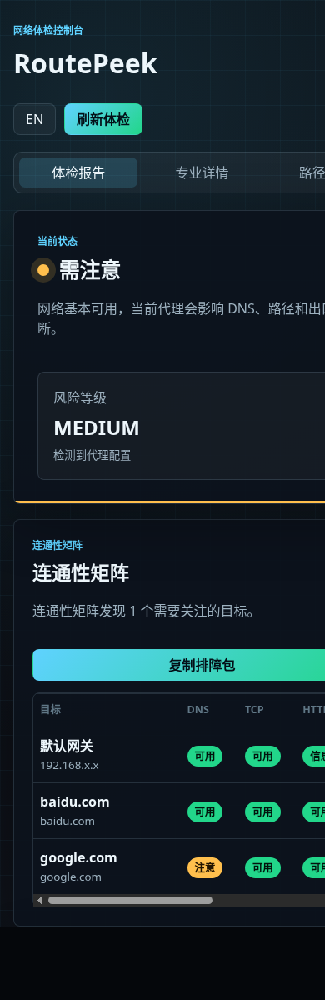

# RoutePeek - 网络拓扑可视化与诊断工具

[English](./README_en.md) | 中文

一款面向网络小白的跨平台网络配置可视化工具，帮助用户理解多网卡、VPN、代理、虚拟机等复杂网络环境。

## 核心特性

| 功能 | 说明 |
|------|------|
| 多网卡检测 | 同时展示有线、WiFi、VPN、虚拟机网络等所有网卡 |
| 动态 SVG 拓扑 | 自动绘制分层网络路径，带动态流向动画，直观展示数据流向 |
| 多语言支持 | 内置中英文支持，根据系统环境自动切换，小白无压力 |
| 通俗解释系统 | 提供网络术语的「大白话」解释，让技术参数不再晦涩 |
| 智能诊断联动 | 诊断结果直接在拓扑图上以脉冲高亮显示，直观定位问题 |
| VPN/代理感知 | 检测全局VPN、代理配置及其对局域网的影响 |
| Traceroute | `/api/trace?target=` 场景化追踪到任意目标的路径 |
| 连通性矩阵 | 同时检查网关、DNS、国内/海外目标，区分 DNS、TCP、HTTP、路径问题 |
| 一键排障包 | Web 一键复制 Markdown，CLI 可导出 Markdown/JSON，默认脱敏后便于发给远程协助者 |

## 架构设计

```
┌─────────────────────────────────────────────────────────────┐
│                         CLI / Web UI                        │
├─────────────────────────────────────────────────────────────┤
│  cmd/cli/main.go          │  cmd/server/main.go            │
│  - Cobra 命令行            │  - HTTP API + 静态页面          │
│  - scan/diag/routes        │  - Gorilla/Mux 路由            │
└─────────────┬───────────────────────────────────────────────┘
              │
┌─────────────▼───────────────────────────────────────────────┐
│                   internal/discovery                        │
│  - GetNetworkSnapshot()  聚合所有网络信息                    │
│  - RunDiagnostics()      执行诊断检查                        │
│  - PrintNetworkOverview() CLI 格式化输出                     │
└─────────────┬───────────────────────────────────────────────┘
              │
┌─────────────▼───────────────────────────────────────────────┐
│        internal/connectivity / internal/report              │
│  - Check()              连通性矩阵                           │
│  - BuildFromSnapshot()  脱敏排障包                           │
└─────────────┬───────────────────────────────────────────────┘
              │
┌─────────────▼───────────────────────────────────────────────┐
│                     pkg/netinfo                              │
│  跨平台网络信息采集（纯 Go，无 cgo）                          │
│                                                             │
│  interface.go   - GetNetworkInterfaces()                   │
│  route.go       - GetRoutes() / GetDefaultGateway()         │
│  dns.go        - GetDNSConfig()                             │
│  proxy.go      - DetectProxy()                              │
│  vpn.go        - DetectVPN() / DetectVMNetworks()           │
│  consts.go     - VPNInterfacePrefixes / KnownVMSubnets     │
└─────────────┬───────────────────────────────────────────────┘
              │
┌─────────────▼───────────────────────────────────────────────┐
│                      pkg/types                               │
│  NetworkInterface / RouteEntry / DNSConfig / ProxyConfig    │
│  VPNInfo / VMNetwork / NetworkSnapshot / DiagnosisReport     │
└─────────────────────────────────────────────────────────────┘
```

## 技术方案

### 跨平台实现
- **Linux/macOS/Windows** 统一接口，底层通过 Shell 命令实现
- 避免 cgo 依赖，便于交叉编译
- 网络接口枚举：`net.Interfaces()` + 平台特定命令
- 路由表读取：`ip route` / `netstat -rn` / `route print`
- DNS 配置读取：`/etc/resolv.conf` / `scutil --dns` / `ipconfig /all`
- VPN 检测：扫描 `tun`/`tap`/`wg`/`utun` 前缀网卡 + 配置目录扫描

### 诊断引擎
- DNS 异常检测：比对已知公共 DNS 列表（Google/Cloudflare/Quad9/OpenDNS/阿里/114）
- 路由冲突检测：同一目标网段存在多条路由
- VPN LAN 影响检测：0.0.0.0/0 覆盖虚拟机网段（192.168.56.0/24、172.17.0.0/16 等）
- 虚拟机网段连通性检测：探测 Docker/VMware/VirtualBox/Hyper-V 网段

### 安全机制
- 只读诊断：RoutePeek 不会自动修改系统网络、代理、DNS、路由或 VPN 配置
- 诊断结果附带解释和手动排查建议，所有系统修改都由用户自行确认执行

## 快速开始

## 运行效果

以下截图使用脱敏演示数据生成，展示真实 Web 控制台的布局、连通性矩阵和一键排障包入口。





### 开发构建

```bash
# 安装并构建 Vue 前端，产物写入 cmd/server/static/dist/
cd web
npm install
npm run build
cd ..

# 构建 Go CLI 和 Web 单二进制
CGO_ENABLED=0 go build -o routepeek ./cmd/cli
CGO_ENABLED=0 go build -o routepeek-web ./cmd/server
```

### 运行

```bash
# Web 界面
./routepeek-web           # 启动 Web 服务器（默认 8080 端口）

# 命令行使用
./routepeek scan          # 查看完整网络配置
./routepeek diag          # 运行网络诊断
./routepeek routes        # 查看路由表
./routepeek interfaces    # 查看网卡详情
./routepeek check         # 检查默认连通性矩阵
./routepeek check baidu.com google.com --json
./routepeek report --format markdown
./routepeek report --format json
```

Web 首页会显示连通性矩阵，并提供“复制排障包”按钮。浏览器 Clipboard API 不可用时，会显示可选中的 Markdown 文本。

### HTTP API

| API | 说明 |
|-----|------|
| `GET /api/snapshot` | 完整网络快照 |
| `GET /api/diagnosis?lang=zh\|en` | 诊断报告 |
| `GET /api/overview?lang=zh\|en` | Web 聚合概览 |
| `GET /api/trace?target=` | 路径追踪 |
| `GET /api/connectivity?lang=zh\|en` | 连通性矩阵 |
| `GET /api/report?format=markdown\|json&lang=zh\|en` | 脱敏远程排障包 |

### 正式打包

```bash
# 当前平台
scripts/build-release.sh

# Linux / macOS / Windows 的 amd64 + arm64
scripts/build-release.sh --all

# 发布前检查：Go 测试、前端测试、前端 build、Go build、Linux/macOS/Windows 发布脚本 smoke build
scripts/check-release.sh
```

发布版本号默认来自 `git describe --tags --always --dirty`：有 tag 时使用 tag，未打 tag 时使用 commit hash，工作区有未提交变更时追加 dirty 标记。根目录 `dist/` 是本地发布产物目录，不纳入版本库；`cmd/server/static/dist/` 是 Web 单二进制嵌入资源目录，由 `npm run build` 或发布脚本生成。

### 常见失败排查

- `index.html not found`：先运行 `cd web && npm run build`，或直接使用 `scripts/build-release.sh`。
- `npm ci` / `npm install` 失败：确认 Node.js 和 npm 可用，并检查网络或 npm registry 配置。
- 路由、DNS、trace 为空或失败：可能是平台命令不可用、权限不足、防火墙拦截或运营商设备不响应；RoutePeek 会展示可理解的空态，不会自动修复系统设置。
- trace 降级为 route probe：说明中间节点追踪受限，RoutePeek 只能确认默认出口选择和目标端口连通性；可尝试管理员权限，但不代表网页一定不可达。
- Fake-IP/TUN：目标解析到 `198.18.0.0/15` 通常表示 Mihomo/Clash 等代理接管 DNS 或 TUN，此时看到的是本地代理虚拟出口。
- 外部目标不可达：若 `baidu.com` 可达但 `google.com` / `8.8.8.8` 不可达，优先检查代理规则、国际出口、DNS 污染或运营商限制。
- 公网 IP 未获取：公网查询服务可能不可达。若网页访问正常，可先忽略该提示。

## 界面概览

### 1. 网络全景（主页）
- **状态摘要**：自然语言一句话总结当前网络状态（例：「✅ 你正通过有线网卡连接路由器上网」）
- **连通性矩阵**：按目标展示 DNS、TCP、HTTP、路径和结论，快速区分 DNS、路由、代理、目标站或出口问题
- **复制排障包**：生成包含系统版本、健康摘要、首要建议、关键网络状态、连通性矩阵、诊断发现和脱敏说明的 Markdown
- **SVG 分层拓扑图**：动态绘制 LAN 层、网关层、外网层，节点间用流动动画连接
- **诊断面板**：如果存在网络异常（如 DNS 篡改、多网卡冲突），直接在下方展示原因和修复建议

### 2. 详细信息
供进阶用户查看完整的技术参数：
- 各网卡详细配置（MAC、MTU、状态）
- 系统路由表（目标网络、网关、Metric）
- DNS 服务器及代理设置

### 3. 路径追踪
- 提供预设场景（测试百度、测试谷歌、测试 DNS）
- 追踪结果分区域着色（本地网络、运营商骨干、目标服务器），带有每跳的通俗解释

## 项目结构

```
RoutePeek/
├── cmd/
│   ├── cli/main.go          # CLI 入口（Cobra）
│   └── server/              # Web 服务器
│       ├── main.go          # 服务器入口
│       └── static/          # Web UI 静态资源
├── internal/
│   ├── diagnostic/          # 诊断引擎
│   ├── connectivity/        # 连通性矩阵
│   ├── discovery/           # 网络信息聚合
│   ├── i18n/                # 多语言支持模块
│   └── report/              # 脱敏排障包
├── pkg/
│   ├── netinfo/             # 跨平台网络信息采集
│   └── types/               # 数据结构定义
├── docs/                    # 项目文档与规划
├── go.mod
└── README.md
```

## 依赖

```
github.com/gorilla/mux v1.8.1    # HTTP 路由
github.com/spf13/cobra v1.8.0     # CLI 框架
```

## 后续计划

- [x] Web UI 使用 SVG 可视化拓扑图
- [x] Vue Web UI + Go embed 单二进制发布
- [x] 发布脚本支持当前平台与跨平台构建
- [x] v0.2: 一键远程排障包 + 连通性矩阵
- [ ] v0.3: 扩展 VPN、代理、DNS、路由、多网卡诊断深度
- [ ] 支持 DNS over HTTPS/TLS 检测（安全审计）
- [ ] Traceroute 跳跃点地理定位集成到详细列表

## 设计背景

MTR/WinMTR 等工具面向高级用户，纯 CLI 输出对网络小白不友好。本工具的核心价值在于**同时展示所有网络层**（有线/WiFi/VPN/代理/虚拟机），并用通俗中文解释每项配置的含义，特别适合排查「VPN 影响虚拟机连接」等常见问题。
